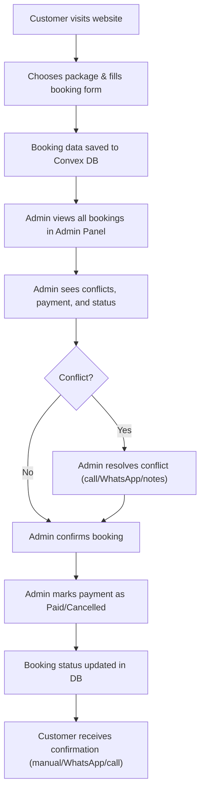

# Nirvarra Farmstay Booking System

A full-stack, zero-cost booking and admin management system for farmstay/hospitality businesses.
Built with **React + Vite + TypeScript + Tailwind CSS** (frontend), **Convex** (backend/database), and **Clerk** (authentication).

---

## 🚀 Tech Stack

- **Frontend:** React, Vite, TypeScript, Tailwind CSS
- **Backend/DB:** Convex (serverless, real-time, free tier)
- **Authentication:** Clerk (free tier)
- **UI Components:** Radix UI, Shadcn UI, Framer Motion
- **Other:** React Router, React Hook Form, Zod

---

## 🏗️ Project Structure

- `/src` — React app source code
  - `/components` — UI and booking form
  - `/admin` — Admin panel, setup, and management
- `/convex` — Convex backend functions and schema
- `.env` / `.env.local` — Environment variables (never commit secrets!)
- `.gitignore` — Ignores node_modules, env files, build output, etc.

---

## 🗂️ Main Features

- **Customer Booking:** Customers select packages and submit booking forms.
- **Admin Panel:** Admins see all bookings, filter, manage payments, and resolve conflicts.
- **Payment Tracking:** Mark bookings as paid/cancelled, see revenue stats.
- **Conflict Detection:** Automatic detection and highlighting of overlapping bookings.
- **Communication:** One-click WhatsApp/call integration for customer follow-up.
- **Role-based Access:** Only registered admins can access the admin panel.
- **Notes & Follow-ups:** Admins can add notes and schedule follow-ups for each booking.

---

## 🔄 Booking & Admin Flow



---

## 🛠️ How to Use

1. **Clone the repo & install dependencies:**
   ```sh
   git clone https://github.com/YOUR_GITHUB_USERNAME/REPO_NAME.git
   cd REPO_NAME
   npm install
   ```

2. **Set up environment variables:**
   - Copy `.env.example` to `.env` and fill in your Clerk/Convex keys.

3. **Start the servers:**
   ```sh
   npx convex dev
   npm run dev
   ```

4. **First-time setup:**
   - Go to `/setup` to register the first admin.
   - Use `/add-admin` to add more admins.

5. **Admin panel:**
   - Visit `/admin` (only admin users can access).

---

## 🧩 Key Convex Functions

- `createBooking` — Save a new booking
- `getAllBookings` — List all bookings for admin
- `updatePaymentStatus` — Mark payment as paid/cancelled
- `updateBookingStatus` — Confirm/cancel bookings
- `getAllDateConflicts` — Detect overlapping bookings
- `addAdminUser` — Add new admin
- `checkAdminAccess` — Verify admin role

---

## 🔒 Security & Best Practices

- **Never commit `.env` or `.env.local`** (contains secrets)
- **All admin actions are role-protected**
- **Customer data is only visible to admins**

---

## 📝 How to Contribute

1. Fork the repo
2. Create a new branch
3. Make your changes
4. Submit a pull request
